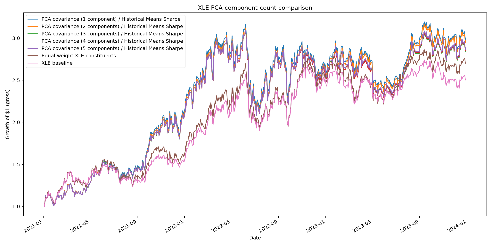
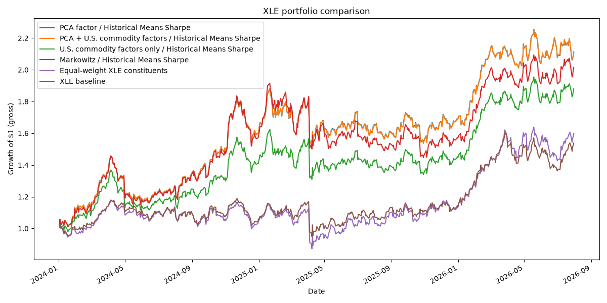
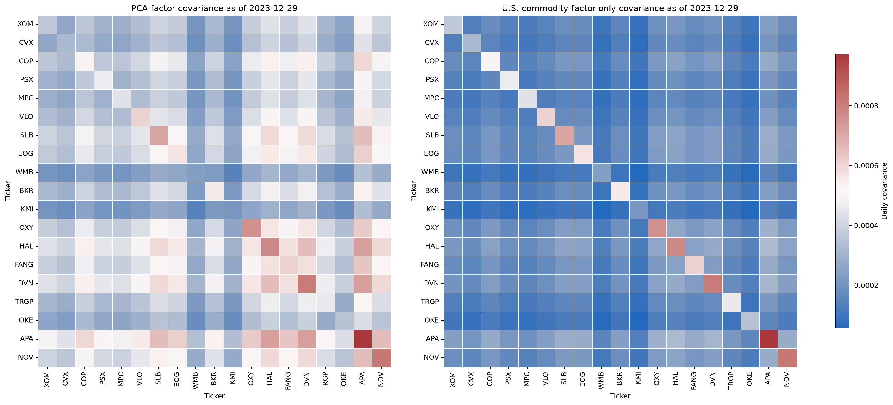
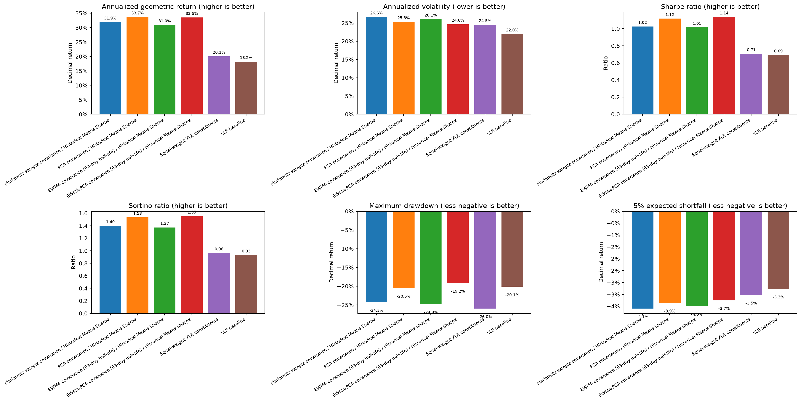
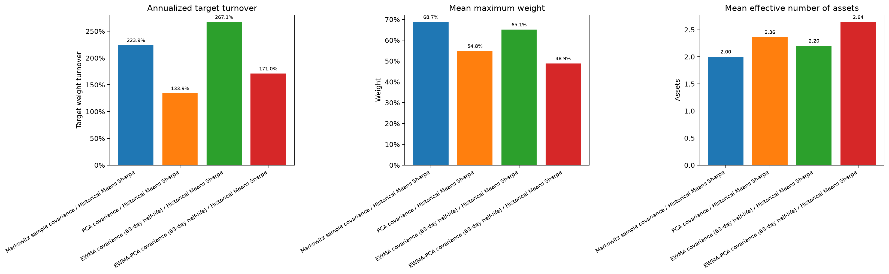
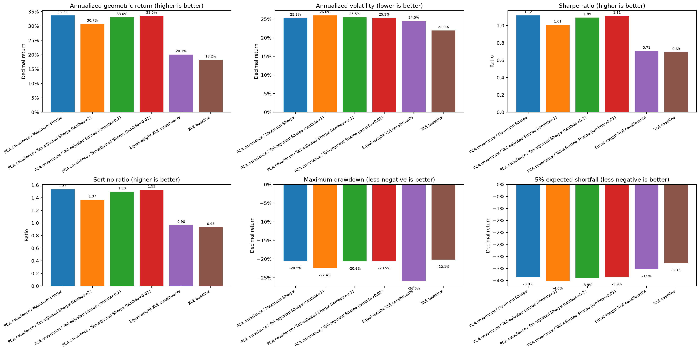
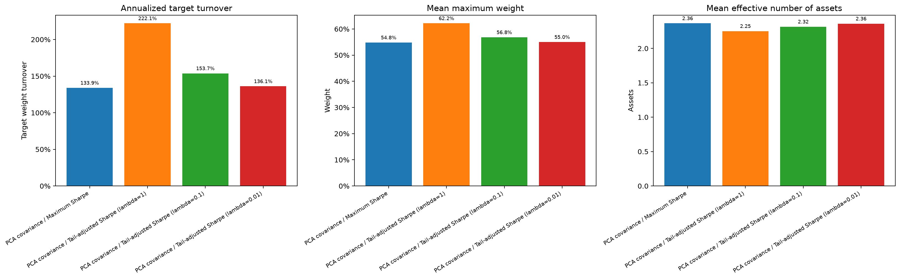

# Experiments in Energy Portfolio Optimization with Factor Modeling

## Introduction

This report documents a small set of walk-forward portfolio-construction
experiments on a fixed universe of energy equities. The purpose is not to identify
an *optimal* strategy or to claim a persistent return premium. Instead, the work
asks narrower questions like:
* how different factor constructions alter a covariance
estimate,
* how exponential recency weighting changes portfolio behaviour, and
* what happens in this sample when a tail-loss term is added to a Sharpe-like objective.

All optimized portfolios use the same historical-mean expected-return estimate,
the same long-only fully-invested constraints, and the same rolling out-of-sample
protocol unless a theme explicitly varies one of those ingredients. The results
are therefore comparisons among particular constructions for this candidate set
and period—not investment advice, a historical XLE constituent simulation, or a
general result about energy markets.

The main findings are mixed. A one-component PCA covariance model
and its PCA-plus-commodity counterpart led cumulative returns in the factor
experiment, but their difference in average daily return was not statistically
significant relative to the PCA-alone model. EWMA-PCA had the strongest realized
risk-adjusted and drawdown metrics
among the covariance variants, again without evidence that its mean daily return
differed from plain PCA. The tail-adjusted candidates changed the holdings and
trading. At $\lambda=1$, realized drawdown and expected shortfall were worse.
At $\lambda=0.1$ and $0.01$, results moved close to ordinary maximum Sharpe
without improving its realized downside measures. These inconclusive results
illustrate both the difficulty of systematically optimizing portfolio
construction and the fact that designing a model around a particular objective
does not guarantee that the objective will be achieved in validation.

## 1. Scope and research questions

The study starts with the mean–variance tradition introduced by
[Markowitz (1952)](https://doi.org/10.1111/j.1540-6261.1952.tb01525.x), but it
does not assume that the classical sample covariance is the only useful risk
input. It uses the annualized Sharpe ratio in the form popularized by
[Sharpe (1966)](https://doi.org/10.1086/294846) as the base portfolio objective,
then changes one modelling component at a time.

The research themes are more specific than broad claims about factor investing or
risk management:

1. **Factor construction:** Within this energy-equity subset, how do a
   statistical PCA factor model, observable U.S.-traded commodity factors, and a
   combined factor panel change the estimated covariance matrix and the resulting
   long-only portfolios?
2. **Covariance construction:** Holding expected returns and the optimizer fixed,
   how do sample covariance, PCA covariance, exponentially weighted moving average (EWMA) covariance, and EWMA-PCA
   covariance change realized risk, concentration, and turnover?
3. **Tail-risk objective:** Holding the PCA covariance model fixed, what changes
   when an empirical expected-tail-loss penalty is added to a Sharpe-like
   denominator across a small sensitivity grid?

These experiments concern *possible constructions*. They are not an exhaustive search or complete comparison to
declare one method universally best.

In particular, the statistically inconclusive
return comparisons noted later do not erase differences in drawdown, expected shortfall,
turnover, or concentration. They only say that this sample does not provide strong
evidence of a difference in average daily return.

## 2. Data, candidate universe, and common protocol

### 2.1 Data and baselines

The candidate energy equity subset is the repository's fixed list of 19 XLE-associated energy
equities, defined in [`xle_data.py`](src/port_opt/backtest/xle_data.py). XLE is the ETF baseline, and an equal-weight portfolio of the same 19 names is a second reference portfolio. The implementation downloads daily prices through `yfinance` and takes percentage changes of the returned `Close` field. Commodity factors are WTI crude oil, Henry Hub natural gas, and RBOB gasoline futures returns. They are factor inputs, **not** portfolio holdings.

The main-theme download request spans 2021-01-01 to 2026-08-01. The reported
out-of-sample comparison contains 647 aligned daily observations, beginning in
2024 after the initial estimation history. The analysis is aligned such that every strategy within an experiment is evaluated on the same return
dates.

The PCA-dimension exercise is earlier, using a separate development period ending in 2023 with 753 out-of-sample observations. It is included merely to suggest that empirical methods can help determine an important parameter such as the number of retained principal components. In practice, more sophisticated methods than those used here would be appropriate.

Some limits to note:

- Historical backtests of this kind can (and frequently do) contain survivorship bias.
- The raw vendor download is not archived with these outputs. `yfinance` and its
  provider can revise historical fields or their adjustment behaviour. A formal
  version of this research would archive the raw input panel, package versions,
  and download timestamp alongside the figures.

### 2.2 Walk-forward Validation / Backtesting

At each rebalance, a strategy sees only the preceding 504 available return
observations (roughly two trading years). It estimates expected returns and
covariance on that window, chooses target weights, and holds those weights for
the next 21 available return observations. The next fit then rolls forward by
21 observations. Rebalance timing is based on available rows. The backtest implementation is
in [`backtest.py`](src/port_opt/backtest/backtest.py).

For assets $1,\ldots,N$, the constraints are

$$
w_i\ge 0,\qquad \sum_{i=1}^{N}w_i=1.
$$

This work does not include leverage, shorting, transaction-cost, market-impact, tax, or
weight-drift model. Reported performance is therefore gross of trading costs.

Turnover is target turnover, excluding the initial funding allocation:

$$
\mathrm{turnover}_j=\frac12\sum_{i=1}^{N}|w_{i,j}-w_{i,j-1}|.
$$

The expected-return estimate is deliberately simple and common across all
optimized portfolios:

$$
\hat\mu_i=\frac1T\sum_{t=1}^{T}r_{i,t},
$$

where $r_{i,t}$ is the daily simple return of asset $i$ in the trailing
window. Thus, the factor and covariance experiments do **not** test a return
forecasting model. They isolate covariance construction and objective choice.
The daily risk-free input has been chosen as $0.04/252$.

### 2.3 Performance and inference

The figures report annualized geometric return, annualized volatility, Sharpe and
Sortino ratios, maximum drawdown, and empirical 5% expected shortfall. If
$r_{p,t}$ is a portfolio's daily return, the empirical expected shortfall is
the average return among days at or below the sample fifth percentile. It does
not assume normally distributed returns.

For the two comparisons specified before inspecting the final tables, the test
uses paired active returns

$$
d_t=r_t^{A}-r_t^{B},\qquad H_0:\mathbb E[d_t]=0,
$$

and a two-sided Bartlett-kernel Newey–West/HAC standard error with 20 lags. This
method is from [Newey and West (1987)](https://www.resea.org/10.2307/1913610)
and is appropriate here because daily active returns may be serially correlated
through overlapping periods of constant weights. The reported p-values are
unadjusted and concern only mean daily return. They do not test cumulative return,
drawdown, expected shortfall, or turnover. The test is appropriate when the evaluated return data exhibit non-constant variance and autocorrelation.

## 3. Covariance models and portfolio objectives

### 3.1 Sample covariance and maximum Sharpe

The sample-covariance comparator uses

$$
\hat\Sigma_{\mathrm{sample}}
=\frac1{T-1}\sum_{t=1}^{T}(r_t-\bar r)(r_t-\bar r)^\top.
$$

For a covariance estimate $\hat\Sigma$, the ordinary optimizer solves the
long-only version of

$$
\max_w\frac{w^\top\hat\mu-r_f}
{\sqrt{w^\top\hat\Sigma w}}.
$$

This is the common construction in all three main themes unless the covariance
or denominator is deliberately replaced. The implementation is in
[`portfolio.py`](src/port_opt/strategy/portfolio.py) and
[`markowitz.py`](src/port_opt/strategy/markowitz.py).

### 3.2 PCA factor covariance

Let $R\in\mathbb R^{T\times N}$ be the centered trailing return panel, and
retain $K$ PCA score series $F\in\mathbb R^{T\times K}$. PCA supplies
orthogonal statistical directions in the in-sample data. It does not require
returns to be Gaussian. Each asset return is then fitted by a multi-output linear
factor regression,

$$
r_t=\alpha+Bf_t+\varepsilon_t,
$$

where $B\in\mathbb R^{N\times K}$ contains factor exposures. The covariance
estimate is

$$
\hat\Sigma_{\mathrm{PCA}}
=B\hat\Sigma_F B^\top+
\mathrm{diag}(\hat\sigma^2_{\varepsilon,1},\ldots,
\hat\sigma^2_{\varepsilon,N}).
$$

The final diagonal term retains asset-specific residual variance
but assumes residual cross-covariances are zero. The model is therefore a
low-rank systematic covariance plus diagonal idiosyncratic risk, not the full
sample covariance. See the implemented estimator in
[`PCA_factor.py`](src/port_opt/strategy/PCA_factor.py).

### 3.3 Commodity and combined factors

For the commodity-only construction, $F$ contains the three observed commodity
return series rather than PCA scores. For the combined construction it contains
both the retained PCA scores and the commodity returns:

$$
F_{\mathrm{combined}}=[F_{\mathrm{PCA}}\, F_{\mathrm{commodity}}].
$$

The combined model is fitted as **one** factor regression and uses the covariance
of the complete combined factor panel. It does not add two independently fitted
asset-covariance matrices. PCA and commodity
factors can share variation so a simple sum would be inappropriate.

### 3.4 EWMA covariance and EWMA-PCA

Exponential weighting is a risk-management device, documented in J.P. Morgan's
[1996 RiskMetrics Technical Document](https://www.msci.com/research-and-insights/paper/1996-riskmetrics-technical-document).
With age $a_t=0$ for the newest observation and half-life $h$, this project
uses normalized weights

$$
q_t=\frac{2^{-a_t/h}}{\sum_{s=1}^{T}2^{-a_s/h}}.
$$

The EWMA covariance is the weighted, mean-adjusted covariance

$$
\hat\Sigma_{\mathrm{EWMA}}
=\sum_{t=1}^{T}q_t(r_t-\bar r_q)(r_t-\bar r_q)^\top.
$$

The half-life is 63 available trading observations, so a return 63 observations
old receives half the unnormalized weight of the most recent return. EWMA-PCA
first forms this weighted covariance, takes its leading $K$ eigenvectors
$V_K$, and reconstructs

$$
\hat\Sigma_{\mathrm{EWMA\text{-}PCA}}
=V_K\Lambda_KV_K^\top+
\mathrm{diag}(
\mathrm{diag}(\hat\Sigma_{\mathrm{EWMA}}-V_K\Lambda_KV_K^\top)
).
$$

In this way, recency weighting applies to the principal directions, their variances,
and residual variances.

### 3.5 Tail-adjusted objective

The third theme uses the PCA covariance and historical mean unchanged. It adds a
portfolio-level empirical tail term. With

$r_{p,t}(w)=w^\top r_t$, let $Q_{.05}(w)$ be the empirical fifth percentile
of in-sample portfolio returns and define positive expected tail loss as

$$
L_{.95}(w)=-\mathrm{mean}\{r_{p,t}(w):
r_{p,t}(w)\le Q_{.05}(w)\}.
$$

The experiment maximizes

$$
\max_w\frac{w^\top\hat\mu-r_f}
{\sqrt{w^\top\hat\Sigma_{\mathrm{PCA}}w}+\lambda L_{.95}(w)},
\qquad \lambda\in\{1, 0.1, 0.01\}.
$$

Both denominator terms are daily-return quantities. $\lambda$ is a
dimensionless tuning parameter. Setting $\lambda=0$ recovers ordinary Sharpe.
This is inspired by the general idea of expected-shortfall/CVaR risk measurement, associated with
[Rockafellar and Uryasev (2000)](https://uryasev.ams.stonybrook.edu/publications/). It is **not the canonical minimum-CVaR program**. It is a nonlinear penalized Sharpe objective and there are simply other, more mature CVaR optimization methods.

## 4. Development choice: retaining one principal component

Before the 2024-onward comparisons, the PCA-dimension experiment varied only
$K\in\{1,2,3,4,5\}$ in a separate 2021–2023 out-of-sample development period.
Expected returns, optimizer, candidate universe, 504-observation lookback, and
21-observation schedule were held fixed. This is a hyperparameter choice within
the PCA construction, not evidence that PCA is better than either baseline.

| Retained PCs | Annualized geometric return | Sharpe | Maximum drawdown | 5% expected shortfall | Annualized turnover |
| ---: | ---: | ---: | ---: | ---: | ---: |
| 1 | 44.5% | 1.051 | -32.8% | -5.30% | 298.3% |
| 2 | 44.0% | 1.043 | -32.9% | -5.29% | 298.8% |
| 3 | 42.3% | 1.010 | -32.9% | -5.31% | 292.9% |
| 4 | 42.4% | 1.013 | -32.9% | -5.30% | 299.9% |
| 5 | 42.6% | 1.017 | -32.9% | -5.30% | 300.8% |

One component had the highest geometric return and Sharpe ratio within this
PCA grid. The differences in the tail metrics were very small, and two components had the marginally less-negative expected shortfall.

Therefore, *the practical
case for $K=1$ is simplicity, not statistical evidence of superiority.* It was then fixed at one component for the three
main themes. Selecting $K$ on the prior period avoids choosing it directly on
the reported 2024–2026 results, although a single development period is still a
weak basis for broad generalization.

*Figure 1. Development-only growth comparison for one through five PCA
components, with the two baseline reference portfolios. The later experiments
do not use this period to claim final strategy performance.*

## 5. Theme 1 — Factor construction in the XLE candidate universe

### 5.1 What was compared

The factor experiment compares the selected one-component PCA model,
PCA-plus-commodity factors, commodity-only factors, and sample-covariance
Markowitz. All four use the same trailing historical mean expected returns and
maximum-Sharpe optimizer. Equal-weight constituents and XLE are reference
baselines. The results below cover the common 647-day final evaluation sample.

| Construction | Cumulative return | Geometric return | Volatility | Sharpe | Maximum drawdown | 5% expected shortfall |
| --- | ---: | ---: | ---: | ---: | ---: | ---: |
| PCA | 111.0% | 33.8% | 25.3% | 1.119 | -20.4% | -3.86% |
| PCA + commodity factors | 111.4% | 33.9% | 25.4% | 1.118 | -20.4% | -3.87% |
| Commodity factors only | 88.0% | 27.9% | 23.5% | 0.997 | -19.4% | -3.55% |
| Sample-covariance Markowitz | 101.5% | 31.4% | 26.7% | 1.007 | -24.4% | -4.12% |
| Equal-weight constituents | 59.9% | 20.1% | 24.5% | 0.706 | -26.0% | -3.52% |
| XLE baseline | 53.8% | 18.2% | 22.0% | 0.691 | -20.1% | -3.27% |

*Figure 2. Gross growth of one unit of capital under the factor-construction
comparisons. The PCA and PCA-plus-commodity paths are close throughout the
sample, not merely at the endpoint.*

### 5.2 Covariance interpretation

The commodity-only factor model clearly does not reproduce the same covariance
structure as the PCA model at the illustrated rebalance date. Its off-diagonal
entries are generally lower, while the PCA model retains a richer pattern of
cross-asset dependence. In this narrow sense, observed commodity returns account
for a meaningful part of co-movement but not all of the dependence captured by
the statistical factor construction. This visual and model-based evidence could
be extended by estimating the share of variance explained.

*Figure 3. Asset covariance estimates at the selected 2023-12-29 rebalance date.
Each panel uses the figure's common scale. The commodity-only construction is
structurally different from PCA, particularly in off-diagonal covariance.*

The implementation table reinforces that distinction. Commodity-only factors
produced a lower mean maximum asset weight (35.5% versus about 55% for the PCA
variants) and a larger effective number of assets (3.86 versus about 2.34), with
similar annualized target turnover (134.8% versus 137.2% and 138.8%). This more
diversified construction had lower realized volatility and milder drawdown and
expected shortfall, but lower return and Sharpe. It may serve as an interesting trade-off.

### 5.3 PCA plus commodities: statistical comparison

The pre-specified comparison uses the paired daily difference between the
combined and PCA-only portfolios. The estimated active mean is

| Comparison | Observations | Annualized mean active return | HAC lag | Two-sided p-value |
| --- | ---: | ---: | ---: | ---: |
| PCA + commodity factors minus PCA | 647 | +0.10% | 20 | 0.570 |

The 95% HAC interval for the *daily* active mean is $-0.000965\%$ to
$+0.001751\%$. The result is compatible with a small positive, zero, or small
negative mean contribution from adding these three commodity series. It does not
support a claim that commodity augmentation raises average daily return in this
sample. The tiny difference in total cumulative return should be read in that
context.

## 6. Theme 2 — Historical covariance with and without recency weighting

### 6.1 What was compared

This experiment changes covariance construction while holding historical means,
the maximum-Sharpe objective, constraints, training window, and rebalance dates
fixed. It isolates four covariance estimators: sample covariance, PCA, EWMA, and
EWMA-PCA. The EWMA half-life is 63 trading observations.

| Covariance estimator | Cumulative return | Geometric return | Volatility | Sharpe | Maximum drawdown | 5% expected shortfall |
| --- | ---: | ---: | ---: | ---: | ---: | ---: |
| Sample covariance | 103.6% | 31.9% | 26.6% | 1.025 | -24.3% | -4.09% |
| PCA | 110.7% | 33.7% | 25.3% | 1.117 | -20.5% | -3.86% |
| EWMA | 99.8% | 31.0% | 26.1% | 1.014 | -24.8% | -3.99% |
| EWMA-PCA | 110.0% | 33.5% | 24.6% | 1.135 | -19.2% | -3.75% |

*Figure 4. Risk and return measures for the four covariance constructions and
the two baselines. EWMA-PCA has the strongest realized Sharpe, Sortino,
drawdown, and 5% expected-shortfall values among the optimized variants, while
plain PCA has the slightly higher geometric return.*

EWMA-PCA also changes the portfolio's implementation profile. Its mean maximum
weight is 48.9% and its effective number of assets is 2.64, compared with 54.9%
and 2.36 for PCA. This is less concentrated, but not costless: annualized target
turnover rises from 133.9% to 171.0%. Pure EWMA turns over the most at 267.1%.

*Figure 5. Target-turnover and concentration comparison for optimized covariance
variants. This figure matters because a change in covariance estimator affects
the chosen portfolio, not only a numerical risk forecast.*

Pure EWMA is also worth keeping as a simple comparator. It changes only the
covariance weighting and does not introduce a factor model. Compared with
sample-covariance Markowitz, it had lower realized volatility (26.1% versus
26.6%), a less negative 5% expected shortfall (-3.99% versus -4.09%), and a
slightly less concentrated average portfolio. It had lower geometric return and
Sharpe, a worse maximum drawdown, and higher turnover. In this narrow
risk-measure sense, EWMA is an interesting low-complexity alternative to sample
covariance rather than a clear overall improvement.

### 6.2 PCA versus EWMA-PCA: statistical comparison

The pre-specified test assesses mean daily return, not the risk metrics above.

| Comparison | Observations | Annualized mean active return | HAC lag | Two-sided p-value |
| --- | ---: | ---: | ---: | ---: |
| EWMA-PCA minus PCA | 647 | -0.29% | 20 | 0.907 |

The daily-mean 95% HAC interval is $-0.02031\%$ to $+0.01802\%$. Thus,
the higher realized Sharpe and improved drawdown of EWMA-PCA should not be
presented as evidence of a higher expected mean return. A more restrained reading
is that exponential weighting produced a different, less concentrated portfolio
with better realized risk statistics in this interval, while the return evidence
is inconclusive.

## 7. Theme 3 — A tail-adjusted Sharpe objective

### 7.1 Sensitivity to the tail-loss weight

This comparison holds the one-component PCA covariance and every other
construction setting fixed. It adds the empirical 95% tail-loss term to the
denominator and compares three positive weights. The lower two weights were
added after reviewing the $\lambda=1$ result. They are an exploratory
sensitivity check, not a pre-specified calibration study.

| Objective | Cumulative return | Geometric return | Volatility | Sharpe | Sortino | Maximum drawdown | 5% expected shortfall |
| --- | ---: | ---: | ---: | ---: | ---: | ---: | ---: |
| Maximum Sharpe | 110.7% | 33.7% | 25.3% | 1.117 | 1.533 | -20.5% | -3.86% |
| Tail-adjusted Sharpe, $\lambda=1$ | 99.0% | 30.7% | 26.0% | 1.009 | 1.368 | -22.4% | -4.03% |
| Tail-adjusted Sharpe, $\lambda=0.1$ | 108.0% | 33.0% | 25.5% | 1.091 | 1.495 | -20.6% | -3.89% |
| Tail-adjusted Sharpe, $\lambda=0.01$ | 110.0% | 33.5% | 25.3% | 1.111 | 1.525 | -20.5% | -3.86% |

*Figure 6. At $\lambda=1$, the tail-adjusted objective is worse across the
reported return and downside metrics. The $\lambda=0.1$ and $0.01$ candidates
are close to ordinary maximum Sharpe but do not provide a clearer realized
downside benefit.*

The grid does not merely return the same weights. At $\lambda=1$, annualized
target turnover rises from 133.9% to 222.1%, mean maximum weight rises from
54.8% to 62.2%, and the strategy reaches a 100% single-asset target allocation
at least once. The smaller weights change the portfolio less. At
$\lambda=0.01$, turnover is 136.1%, mean maximum weight is 55.0%, and the
effective number of assets is almost unchanged at 2.36.

*Figure 7. The $\lambda=1$ objective changes turnover and concentration
materially. The lower-weight candidates are progressively closer to maximum
Sharpe, as expected when the tail-loss term has less influence.*

### 7.2 Interpretation

The result says that this particular nonlinear objective did not improve
realized downside outcomes in this 647-day period. The $\lambda=1$ candidate
was clearly worse by the stated measures. The smaller penalties were close to
ordinary maximum Sharpe. The $\lambda=0.01$ candidate had nearly the same
volatility, drawdown, and expected shortfall as maximum Sharpe, but did not
improve them.

This is not a claim that expected-shortfall constraints or CVaR optimization are
generally ineffective. It applies to a 504-day trailing sample, a 5% tail
threshold, long-only constraints, roughly monthly rebalancing, and this
particular penalized objective.

Several explanations are plausible but untested here:

- A 5% tail statistic in a 504-observation window is based on roughly 25 tail
  days, so its portfolio ranking can be noisy and discontinuous as weights vary.
- The penalty is added to volatility, rather than solving a standard minimum-CVaR
  or constrained-CVaR program. The chosen $\lambda$ is not calibrated to a
  stakeholder loss budget or selected on a prior development period.
- The two smaller values were added after the initial final-period result. Their
  similarity to maximum Sharpe should not be used to select a preferred
  $\lambda$ from this same period.
- Volatility and empirical tail loss are overlapping measures of the same recent
  return distribution. Penalizing both may distort the maximum-Sharpe allocation
  without supplying enough independent risk information.
- The objective does not penalize turnover or concentration. The reported shift
  toward more concentrated, more active targets is consistent with that omission.

A separately designed calibration study would be needed to determine whether
these explanations are true.

## 8. Cross-theme interpretation

The results support a modest research conclusion.

- **Factor information is not interchangeable.** Commodity-only covariance
  creates a materially different and more diversified portfolio. Adding those
  factors to PCA, however, changes little in this sample and does not have a
  statistically supported mean-return contribution.
- **Risk estimation changes portfolio behaviour.** EWMA-PCA exhibited more
  favourable realized risk statistics and lower concentration than PCA, but the
  paired return test supplies no evidence that it has a higher mean return. Pure
  EWMA is a useful simple comparator because it improves a few realized
  risk measures relative to sample covariance, though not the full profile.
- **A more complicated objective can be worse.** The tail-adjusted objective
  changed the portfolio substantially at $\lambda=1$ and delivered worse
  realized tail metrics. Smaller positive penalties largely recovered the
  maximum-Sharpe portfolio without demonstrating a downside benefit. Complexity
  is not evidence of better risk control.

The two most defensible candidate constructions for further, separately designed
testing may be plain PCA and EWMA-PCA. This report does not prove
either is optimal, but both produce transparent covariance structures,
competitive gross results in the stated interval, and distinct implementation
profiles. Commodity-only factors remain informative as a low-complexity,
more-diversified comparator while PCA-plus-commodity factors have yet to show a reproducible benefit outside this sample.

## 9. Limitations and next research boundary

The following limitations should accompany any presentation of these results.

1. **Single universe and interval.** The universe is a static energy-equity list
   and the final sample is one 2024–2026 interval. Regime dependence and
   survivorship bias are real possibilities.
2. **Gross returns and target turnover.** Trading frictions, taxes, and weight
   drift are omitted. This is especially notable because annualized target turnover is substantial for every optimized candidate.
3. **Expected returns are historical means.** The work evaluates covariance and
   objective constructions conditional on a simple mean estimate. It does not
   establish that those means are economically forecastable.
4. **Factor-model assumptions.** PCA is linear and does not require Gaussian
   returns to be computed, but the covariance construction uses linear exposures
   and diagonal residual covariance. Empirical expected shortfall avoids a
   normal-tail assumption, but its precision is limited by the number of observed
   tail days.
5. **Limited statistical inference.** There are only two pre-specified, unadjusted paired
   HAC tests. Neither supports a mean-return difference. No test here proves a
   difference in risk metrics or validates a future strategy.

## References

- Markowitz, H. (1952). *Portfolio Selection*. **The Journal of Finance**, 7(1),
  77–91. [https://doi.org/10.1111/j.1540-6261.1952.tb01525.x](https://doi.org/10.1111/j.1540-6261.1952.tb01525.x)
- Newey, W. K., & West, K. D. (1987). *A Simple, Positive Semi-Definite,
  Heteroskedasticity and Autocorrelation Consistent Covariance Matrix*.
  **Econometrica**, 55(3), 703–708.
  [https://doi.org/10.2307/1913610](https://doi.org/10.2307/1913610)
- RiskMetrics Group. (1996). *RiskMetrics Technical Document*, fourth edition.
  [MSCI research paper](https://www.msci.com/research-and-insights/paper/1996-riskmetrics-technical-document)
- Rockafellar, R. T., & Uryasev, S. (2000). *Optimization of Conditional
  Value-at-Risk*. **The Journal of Risk**, 2(3), 21–41.
  [Publication record](https://uryasev.ams.stonybrook.edu/publications/)
- Sharpe, W. F. (1966). *Mutual Fund Performance*. **The Journal of Business**,
  39(1), 119–138. [https://doi.org/10.1086/294846](https://doi.org/10.1086/294846)
